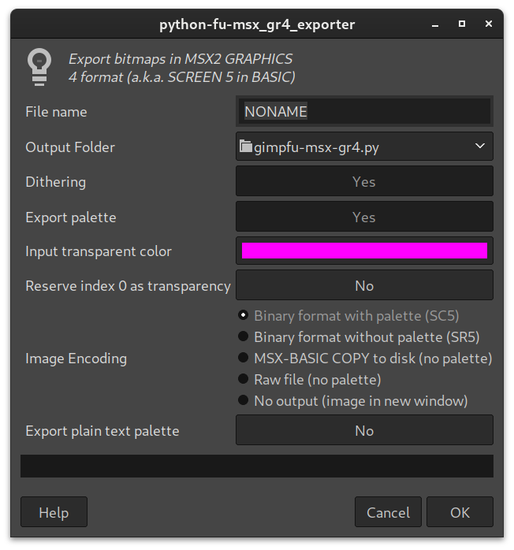

# gimp-msx-g4.py



GIMP script to export bitmap as GRAPHICS 4 file (a.k.a. "SCREEN 5"). GRAPHICS 4 specs are: 

* 4 pages;
* 256x1024 image (256 per page) with a 256x212 or 256x192 viewport;
* 16 color palette (from 512);
* sprite mode 2;

Plug-in is accessible through _Filters > MSX >> Export GRAPHICS 4 bitmap_.  You may disable **Image Encoding** altogether to create an image inside GIMP and not export it to disk at all. In this case, the plug-in doesn't check image size. But be warned: big images tend to take a very. Long. Time.

### Meaning of input fields

* Input transparent color: if the source image doesn't have any transparency, consider this colour the transparent colour when converting image to the MSX (index 0). This requires "Reserve index 0 as transparency" to be active.
* Reserve index 0 as transparency: the plugin can optionally use the colour index 0 as a normal colour and improve dithering a little bit if you disable this.
* Image encoding: common MSX image formats the plugin recognises.

### Latest changes

* The plugin now detects if a predefined transparent colour is being used and force it to index 0. "Reserve index 0 as transparency" must be activated. 
* The plugin now uses the alpha channel of RGBA images as transparent colour automatically (second option in the filter menu).

## Original vs sample image

#### As usual, here is a picture of a good girl for comparison:


## Installation: 
- Change permission to execute the file:
  - For GIMP2, ```chmod +x gimp2_msx_g4.py```
  - For GIMP3, ```chmod +x gimp3_msx_g4.py```
- For GIMP 2, put `gimp2_msx_g4.py` in your GIMP plugin directory:
  - if you installed as a normal package, it's `~/.config/GIMP/2.10/plug-ins/`;
  - if you installed as a flatpak package, it's `~/.var/app/org.gimp.GIMP/config/GIMP/2.10/plug-ins/`;
- For GIMP 3, put `gimp3_msx_g4.py` in a subdirectory with the same name in the plugin directory:
  - if you installed as a normal package, it's `~/.config/GIMP/2.10/plug-ins/gimp3_msx_g4`;
  - if you installed as a flatpak package, it's `~/.var/app/org.gimp.GIMP/config/GIMP/2.10/plug-ins/gimp3_msx_g4`;
- Restart GIMP

## Loading SC5 files

You may load files created by this plug-in using this simple code in BASIC:
```
10 SCREEN 5
20 REM use line below if transparency is disabled
30 VDP(9)=VDP(9) OR &H20
40 BLOAD"NONAME.SC5",S
50 COLOR=RESTORE
60 IF INKEY$ = "" GOTO 60
```
File (NONAME.SC5) contains the pattern and palette data. If image height is 237 pixels or more, the palette data will overwrite the pattern data. It's recommended to use SR5 with a separate palette file in this case.

## Loading SR5 files

Loading SR5 files is just a little different in BASIC:
```
10 SCREEN 5
20 REM use line below if transparency is disabled
30 VDP(9)=VDP(9) OR &H20
40 BLOAD"NONAME.PAL",S
50 COLOR=RESTORE
60 BLOAD"NONAME.SR5",S
70 IF INKEY$ = "" GOTO 70
```
The first file (NONAME.PAL) is the palette and the second file (NONAME.SR5) is the pattern data and you need both to get the right image.

## Loading DAT files

DAT (DATA) files are copies of portions of the screen dumped to a disk file. They are created by MSX-BASIC COPY command and are limited to a maximum of 212 pixels height. Loading DAT files in BASIC is easy:
```
10 SCREEN 5
20 REM use line below if transparency is disabled
30 VDP(9)=VDP(9) OR &H20
40 BLOAD"NONAME.PAL",S
50 COLOR=RESTORE
60 COPY "NONAME.DAT" TO (0,0), 0
70 IF INKEY$ = "" GOTO 70
```
A palette file (NONAME.PAL) is still recommended to restore the image properly.

## TODO

* [ ] ordered dithering;
* [x] make it faster (GIMP3 version);
* [x] enable or disable transparent colour;
* [x] palette export;
* [x] RGB to indexed conversion;
* [x] export raw file to be used by external compressors;
* [x] ignore alpha channel instead of triggering errors;
* [x] embedded palette support;
* [x] MSX-BASIC COPY to disk format support;
* [x] enable user to define the transparent colour;
* [ ] RLE encoding;
* [ ] aPLib compression;
* [ ] converting layers into pages;

